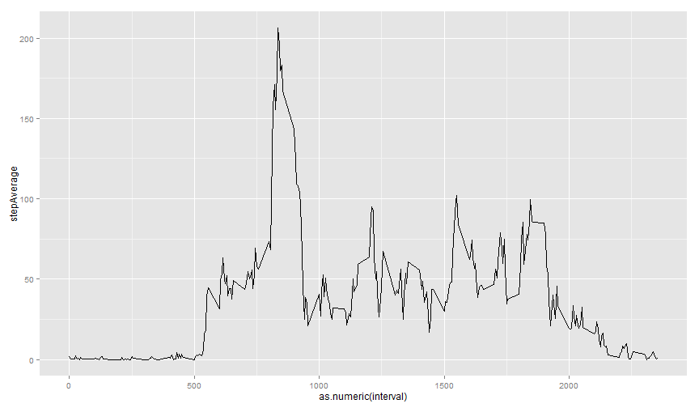
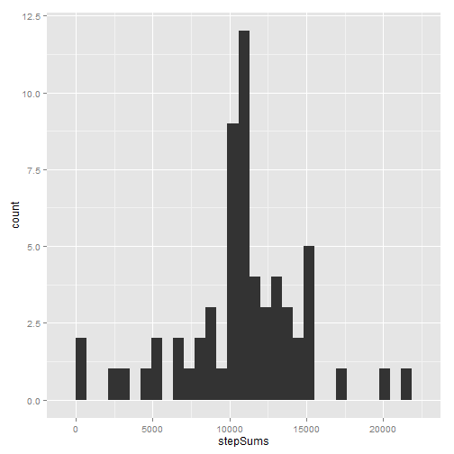
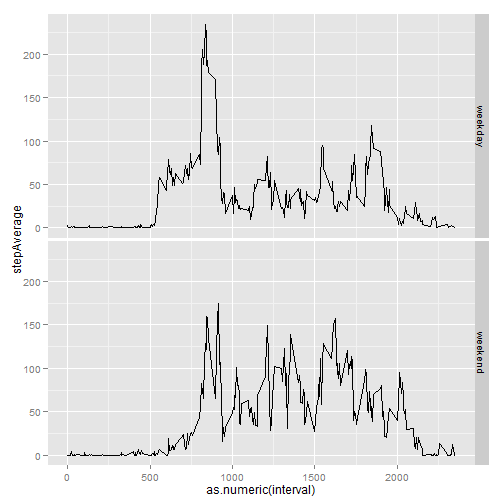

# Reproducible Research: Peer Assessment 1


## Loading data and transform the date in the data to Date type

```r
data <- read.csv("activity.csv")
data$date <- as.factor(data$date)
data$interval <- as.factor(data$interval)
str(data)
```

```
## 'data.frame':	17568 obs. of  3 variables:
##  $ steps   : int  NA NA NA NA NA NA NA NA NA NA ...
##  $ date    : Factor w/ 61 levels "2012-10-01","2012-10-02",..: 1 1 1 1 1 1 1 1 1 1 ...
##  $ interval: Factor w/ 288 levels "0","5","10","15",..: 1 2 3 4 5 6 7 8 9 10 ...
```

As we can see, the data contain 3 varibles which are numeric variables "steps", date variable "date" (converted to factors) and numerical variable "interval" (converted to factors).  


## What is mean total number of steps taken per day?

```r
library("ggplot2")
stepsDaySum <- data.frame(stepSums = rep(0, length(levels(data$date))), day = "2000-1-1", 
    stringsAsFactors = FALSE)
for (i in 1:length(levels(data$date))) {
    stepsDaySum$stepSums[i] <- sum(subset(data$steps, data$date == levels(data$date)[i]), 
        na.rm = TRUE)
    stepsDaySum$day[i] <- levels(data$date)[i]
}
qplot(stepSums, data = stepsDaySum)
```

```
## stat_bin: binwidth defaulted to range/30. Use 'binwidth = x' to adjust this.
```

 

```r
meanStepsSumDay <- mean(stepsDaySum$stepSums, na.rm = TRUE)
medianStepsSumDay <- median(stepsDaySum$stepSums, na.rm = TRUE)
```

The mean of the steps in every day is about 

```r
meanStepsSumDay
```

```
## [1] 9354
```

The median of the steps in every day is about 

```r
medianStepsSumDay
```

```
## [1] 10395
```


## What is the average daily activity pattern?

```r
stepsIntervalAverage <- data.frame(stepAverage = rep(0, length(levels(data$interval))), 
    interval = "0", stringsAsFactors = FALSE)
for (i in 1:length(levels(data$interval))) {
    stepsIntervalAverage$stepAverage[i] <- mean(subset(data$steps, data$interval == 
        levels(data$interval)[i]), na.rm = TRUE)
    stepsIntervalAverage$interval[i] <- levels(data$interval)[i]
}
qplot(as.numeric(interval), stepAverage, data = stepsIntervalAverage, geom = "line")
```

 

```r

maximInterval <- stepsIntervalAverage$interval[which.max(stepsIntervalAverage$stepAverage)]
```


The interval containing the maxim average of steps in a day is (0-5 minutes is interval 0) : 

```r
maximInterval
```

```
## [1] "835"
```


## Imputing missing values

```r
naData <- subset(data, is.na(data$steps) == TRUE)
naNumbers <- nrow(naData)
naRows <- as.numeric(row.names(naData))
```


The total number of missing values in the dataset is:

```r
naNumbers
```

```
## [1] 2304
```

Here is my strategy for missing values: I assume the steps across days are distributed normally. The calculation steps are:

First, i obtain the mean and variance of the steps across 61 same intervals in different days .

Second, i generate 200 random values using normal distribution whose parameters are calculated by last step in the same interval. 

Third, calculate the mean of the 200 random values and take the nearest integer as the missing value.

The new dataset without NAs I created is call "dataNoNA".

```r
dataNoNA <- data
set.seed(8888)
for (n in naRows) {
    meanNA <- mean(subset(data$steps, data$interval == data$interval[n]), na.rm = TRUE)
    sdNA <- sd(subset(data$steps, data$interval == data$interval[n]), na.rm = TRUE)
    replaceNA <- round(mean(rnorm(200, mean = meanNA, sd = sdNA)))
    dataNoNA$steps[n] = replaceNA
}
```


Creat the histgram and calculte the mean and median


```r
stepsDaySum <- data.frame(stepSums = rep(0, length(levels(dataNoNA$date))), 
    day = "2000-1-1", stringsAsFactors = FALSE)
for (i in 1:length(levels(dataNoNA$date))) {
    stepsDaySum$stepSums[i] <- sum(subset(dataNoNA$steps, dataNoNA$date == levels(dataNoNA$date)[i]), 
        na.rm = TRUE)
    stepsDaySum$day[i] <- levels(dataNoNA$date)[i]
}
qplot(stepSums, data = stepsDaySum)
```

```
## stat_bin: binwidth defaulted to range/30. Use 'binwidth = x' to adjust this.
```

 

```r
meanStepsSumDay <- mean(stepsDaySum$stepSums, na.rm = TRUE)
medianStepsSumDay <- median(stepsDaySum$stepSums, na.rm = TRUE)
```


The mean value is:

```r
meanStepsSumDay
```

```
## [1] 10769
```

The median value is :

```r
medianStepsSumDay
```

```
## [1] 10765
```

They are different from the previewsly calculated numbers. The impact of filling the missing value is increasing the mean and median and decreasing the number of average steps took per day around zero. 


## Are there differences in activity patterns between weekdays and weekends?


```r
dataWeekdays <- data.frame(data, weeksday = weekdays(as.Date(data$date)))
dataWeekdays$weeksday <- as.character(dataWeekdays$weeksday)
for (n in 1:nrow(dataWeekdays)) {
    if (dataWeekdays$weeksday[n] == "星期六" || dataWeekdays$weeksday[n] == 
        "星期日") 
        dataWeekdays$weeksday[n] = "weekend" else dataWeekdays$weeksday[n] = "weekday"
}
dataWeekdays$weeksday <- as.factor(dataWeekdays$weeksday)
```


```r
stepsIntervalAverage <- data.frame(stepAverage = rep(0, length(levels(dataWeekdays$weeksday)) * 
    length(levels(dataWeekdays$interval))), interval = "0", weeksday = "星期一", 
    stringsAsFactors = FALSE)
for (j in 1:length(levels(dataWeekdays$weeksday))) {
    for (i in 1:length(levels(dataWeekdays$interval))) {
        index = (j - 1) * length(levels(dataWeekdays$interval)) + i
        stepsIntervalAverage$stepAverage[index] <- mean(subset(dataWeekdays$steps, 
            dataWeekdays$interval == levels(dataWeekdays$interval)[i] & dataWeekdays$weeksday == 
                levels(dataWeekdays$weeksday)[j]), na.rm = TRUE)
        stepsIntervalAverage$interval[index] <- levels(dataWeekdays$interval)[i]
        stepsIntervalAverage$weeksday[index] <- levels(dataWeekdays$weeksday)[j]
    }
}


qplot(as.numeric(interval), stepAverage, data = stepsIntervalAverage, facets = weeksday ~ 
    ., geom = "line")
```

 


