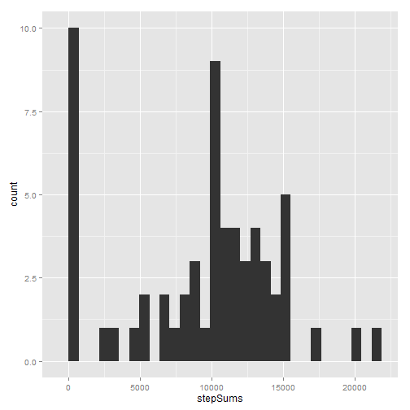

# Reproducible Research: Peer Assessment 1


## Loading data and transform the date in the data to Date type

```r
data <- read.csv("activity.csv")
data$date <- as.Date(data$date)
str(data)
```

```
## 'data.frame':	17568 obs. of  3 variables:
##  $ steps   : int  NA NA NA NA NA NA NA NA NA NA ...
##  $ date    : Date, format: "2012-10-01" "2012-10-01" ...
##  $ interval: int  0 5 10 15 20 25 30 35 40 45 ...
```

As we can see, the data contain 3 varibles which are numeric variables "steps", date variable "date" and numerical variable "interval".  


## What is mean total number of steps taken per day?

```r
library("ggplot2")
qplot(steps, data = data, binwidth = 30)
```

 

```r
meanSteps <- mean(data$steps, na.rm = TRUE)
medianSteps <- medianSteps(data$steps, na.rm = TRUE)
```

```
## Error: 没有"medianSteps"这个函数
```


## What is the average daily activity pattern?


## Imputing missing values


## Are there differences in activity patterns between weekdays and weekends?
